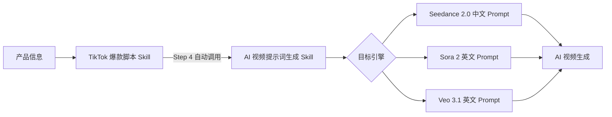

# 🎥 AI 视频提示词生成 Skill

> **将 TikTok 爆款脚本的分镜画面，逐镜头转化为 AI 视频引擎的结构化提示词**

---

## 📌 这是什么？

这是一个专为 **AI 视频生成** 设计的 Agent Skill。它接收 TikTok 带货脚本中的分镜画面描述，精准转化为可直接投喂 **Seedance 2.0 / Veo 3.1 / Sora 2** 的结构化提示词，实现「脚本创作 → 视频提示词 → AI 视频生成」的完整闭环。

核心理念：**最大化画面还原度、UGC 原生感和人物/空间一致性**，让 AI 生成的视频看起来像真人用手机拍的真实 UGC 内容。

---

## ✨ 核心能力

| 能力 | 说明 |
|------|------|
| 🔄 **脚本→提示词转化** | 自动解析分镜画面描述，套用 5 段式公式生成结构化 Prompt |
| 🤖 **三大引擎适配** | 原生支持 Seedance 2.0（默认）、Sora 2、Veo 3.1，各引擎独立输出格式 |
| 📹 **UGC 原生感控制** | 内置"去 AI 化"视觉约束系统，确保生成画面的手机实拍质感 |
| 🎬 **智能片段合并** | 遵循"少量片段原则"，将脚本合并为 2-4 段，最大化画面连续性 |
| 🔒 **安全合规引擎** | 内置四大类违禁词自动扫描与替换机制 |

---

## 🚀 快速开始

### 输入来源

本 Skill 的标准输入来自 **tiktok爆款脚本制作skill** 的 Step 2 输出（2 套配音与分镜文案），也可以独立使用。

### 输入格式

脚本采用三模块结构，本 Skill 只需关注 **模块二** 中每个阶段的画面描述：

```
模块一：爆款标题（3 个）        → 不处理
模块二：配音与分镜文案（2 套）  → ✅ 提取画面描述进行转化
模块三：精准标签策略（10 个）   → 不处理
```

### 使用示例

```
请将以下 TikTok 脚本转化为 Seedance 2.0 视频提示词：

Script 1 (框架 A: 痛点反转型)
- [0-3s] Hook: ... > 画面：镜头特写一把钝刀在番茄上来回锯...
- [3-8s] Agitate: ... > 画面：...
- [8-15s] Solve: ... > 画面：...
...
```

---

## 🎯 5 段式提示词公式

每个合并后的视频片段都按此公式生成：

```
[镜头语言] + [主体] + [动作序列] + [环境/光影] + [风格/音频]
```

| 段落 | 说明 | 示例 |
|------|------|------|
| **镜头语言** | 运镜方式与构图 | `手持第一人称视角极近特写` |
| **主体** | 角色与核心道具 | `一位穿着宽松连帽衫的年轻女性，拿着产品` |
| **动作序列** | 时间序列化的行为描述 | `先展示旧工具的痛苦，然后切换到新产品的一步操作` |
| **环境/光影** | 场景设定与光线 | `美式郊区厨房，自然窗户光，带有阴影` |
| **风格/音频** | 视觉风格与声音设计 | `iPhone 竖屏画质，背景是轻松的 TikTok 音乐` |

---

## 🤖 支持的 AI 视频引擎

### Seedance 2.0（默认首选）

| 特性 | 详情 |
|------|------|
| **核心优势** | 强大的多模态参考能力（图/视频混合） |
| **语言** | 提示词必须用 **纯中文** 生成 |
| **参考标签** | `@图片N`、`@视频N`，自然融入 Prompt 文本 |
| **角色锚定** | 使用"真人出镜超级文本锁"拼接在 Prompt 开头 |
| **音频处理** | 舍弃 `@Audio`，口播台词用引号嵌入画面描述 |

> **多模态参考极简准则**：只给核心产品特写和难以形容的关键交互动态。通用元素（森林、番茄等）完全靠文字描述。严禁用视频参考角色表情。

### Sora 2

| 特性 | 详情 |
|------|------|
| **核心优势** | 极其逼真的流体、重力、碰撞物理模拟 |
| **语言** | 英文自然语言叙事 |
| **连接词** | `Then`、`While`、`As` 串联动作；`[Cut to]` 切换场景 |
| **角色锚定** | `@Cameo` 锁定同一角色 |

### Veo 3.1

| 特性 | 详情 |
|------|------|
| **核心优势** | 原生 9:16 竖屏 + 4K + 原生声画同步对白 |
| **语言** | 英文，严格 5 段式 |
| **音频** | 末尾必须包含 `Audio:` / `SFX:` 指令 |
| **串联** | Scene Extension 功能串联多段 |

### 引擎对比速览

| | Seedance 2.0 | Sora 2 | Veo 3.1 |
|---|:---:|:---:|:---:|
| **多模态参考** | ⭐⭐⭐ | ⭐ | ⭐ |
| **物理模拟** | ⭐⭐ | ⭐⭐⭐ | ⭐⭐ |
| **音频同步** | ⭐⭐ | ⭐⭐ | ⭐⭐⭐ |
| **竖屏原生** | ✅ | ✅ | ✅ 9:16 |
| **上手难度** | ⭐⭐⭐ | ⭐⭐ | ⭐⭐⭐ |

---

## 📹 UGC 原生感三大支柱

本 Skill 内置全局视觉风格约束，确保生成的视频具有美区 TikTok 原生感：

| 支柱 | 核心原则 | 关键提示词 |
|------|----------|------------|
| **去 AI 化** | 对抗过度精致感 | `手机原生画质`、`手持晃动感`、`真实皮肤纹理` |
| **美区本土化** | 一眼看上去像美国家庭 | `美式郊区厨房`、`美国超市货架过道` |
| **邻家感** | 像认识的朋友 | `宽松连帽衫`、`随意的丸子头`、`生动表情` |

> *"糙一点往往比美一点转化率更高。"*

---

## 📂 目录结构

```
AI视频提示词生成skill/
├── SKILL.md                                # 🔧 核心指令文件
├── README.md                               # 📖 本文档
├── examples/                               # 📚 实战示例
│   ├── text-to-video.md                    #    工具类产品多引擎对比示例
│   └── skincare-ugc-seedance.md            #    美妆护肤 Seedance 全流程示例
├── resources/                              # 📦 资源库
│   ├── prompt-templates.md                 #    使用模板 & 前置检查清单
│   ├── script-conversion-template.md       #    分镜→提示词转化标准格式
│   ├── tiktok-ugc-style-guide.md           #    UGC 风格指南（镜头/光影/音效词库）
│   └── parameter-cheatsheet.md             #    三大引擎参数速查表
└── output/                                 # 📤 生成内容输出目录
```

---

## 🔗 工作流协同

本 Skill 是完整 AI 视频制作流水线的**第二环节**：



- **上游**：`tiktok爆款脚本制作skill` 在 Step 4 会自动调用本 Skill
- **也可独立使用**：直接提供分镜画面描述即可

---

## 🛡️ 质量保障

每次输出前自动执行 **8 项质量自检**：

1. ✅ 5 段式完整性（镜头+主体+动作+环境+风格/音频）
2. ✅ UGC 风格一致性（无影棚感、含手持/自然光关键词）
3. ✅ Prompt 长度 100-200 词，无过载风险
4. ✅ 音频/口播指令完整（背景音乐+口播引号嵌入）
5. ✅ 片段数量 2-4 段，每段 5-15 秒
6. ✅ 引擎专属语法适配
7. ✅ 空间/人物连贯一致性
8. ✅ **四大类违禁词扫描**（政治 / 暴力色情 / 侵权 / 广告法极端词）

---

## 🚫 禁忌清单

| 类型 | ❌ 禁止 | ✅ 替代 |
|------|---------|---------|
| 模糊指令 | "amazing video"、"high quality" | 具体物理描述 |
| 广告感 | "professional studio"、"premium look" | UGC 真实场景描述 |
| AI 机械词 | Elevate、Revolutionary、Game-changing | 自然口语化表达 |
| 文本过载 | 超 200 词的单段 Prompt | 100-150 词精简描述 |
| 抽象概念 | "产品很棒" | "刀刃零阻力滑过番茄" |

---

## 💡 高阶技巧

- **时间线提示词**：对精确卡点的快剪段适用 `[0s-2s]...[2s-5s]...` 格式
- **多节拍叙事**：Payoff 段用 `First → Then → Finally` 串联多场景
- **音频策略**：Hook 用突发声效、Agitate 用不适声效、Payoff 用 ASMR 满足感声效
- **角色锚定**：Seedance 通过"文本锁"实现跨片段角色一致性
