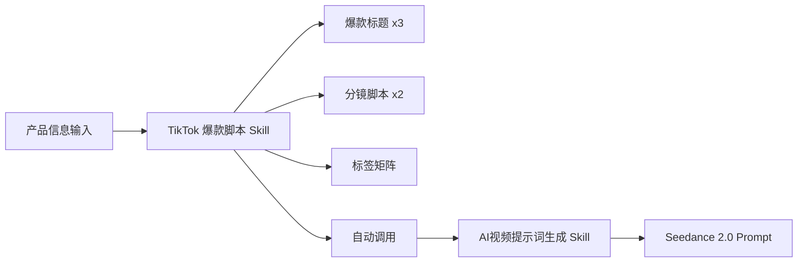

# 🎬 TikTok 爆款带货脚本制作 Skill

> **一键生成高完播率、强转化的 TikTok UGC 带货视频脚本 + AI 视频提示词**

---

## 📌 这是什么？

这是一个专为 **TikTok 美国市场** 设计的 AI Agent Skill。它能根据产品信息，自动输出一套完整的带货视频方案——从爆款标题、分镜配音脚本、精准标签，到可以直接喂给 AI 视频引擎（如 Seedance 2.0）的 Prompt，**全链路一步到位**。

核心理念：用 **"滑屏心理学"** 和 **营销心理学触发器** 驱动内容创作，让每一秒都有信息密度，最大化完播率与转化率。

---

## ✨ 核心能力

| 能力 | 说明 |
|------|------|
| 🧲 **爆款标题生成** | 基于好奇心缺口、惊讶等心理触发器，生成 3 个不同视角的英文标题（附中文翻译） |
| 🎙️ **双语分镜脚本** | 输出 2 套完整剧本，含配音口播 + 画面分镜 + 关键字幕标注，大量使用 Gen Z 俚语 |
| 🏷️ **精准标签矩阵** | 10 个层级化 Hashtag，覆盖泛流量→垂直→长尾，直接可复制 |
| 🤖 **AI 视频提示词** | 自动将脚本转化为 Seedance 2.0 兼容的中文 Prompt，含 References 排版 |

---

## 🚀 快速开始

### 输入要求

| 参数 | 必需 | 说明 |
|------|:----:|------|
| **产品名称/型号** | ✅ | 明确要推广的产品 |
| **基本信息/痛点资料** | ✅ | 产品卖点、痛点、物理特性等（可引用 `resources/pain_points/` 下的文件） |
| **对标爆款案例** | ❌ | 可选，指定 `examples/` 下的案例文档，将直接复用其脚本骨架 |

### 使用示例

```
请为以下产品生成 TikTok 爆款脚本：
- 产品：滚筒磨刀器 (Rolling Knife Sharpener)
- 价格：$25
- 对标案例：examples/滚筒磨刀器案例.md
```

Agent 将自动完成以下 4 步输出：

```
Step 1 → 3 个爆款标题（标注心理学触发器 + 中文翻译）
Step 2 → 2 套完整双语分镜脚本（配音 + 画面 + 字幕标注）
Step 3 → 10 个层级化精准标签
Step 4 → AI 视频提示词（自动调用 AI视频提示词生成skill）
```

---

## 🧠 四大爆款框架

Skill 内置 4 种经过验证的内容框架，根据产品特性自动匹配：

| 框架 | 适用场景 | 结构 | 代表案例 |
|------|----------|------|----------|
| **A · 痛点反转型** | 有明确"旧 vs 新"对比的产品 | Hook→Agitate→Solve→Payoff→CTA | 滚筒磨刀器 |
| **B · 诱饵调包型** | 视觉奇观较弱，需猎奇引流 | Hook(奇观)→Agitate→Solve→Payoff→CTA | 油炸苹果 |
| **C · 视觉验证混剪** | 冲动消费型低客单小物件 | Hook→Solve(黑科技)→Payoff(极限快剪)→CTA | 129N 爆款 |
| **D · 多场景轰炸型** | 卖点清晰、适用场景广的日用品 | Hook(开箱)→Trust→Solve→Payoff(多场景)→CTA | 胶带 |

---

## 📂 目录结构

```
tiktok爆款带货脚本制作skill/
├── SKILL.md                          # 🔧 核心指令文件（Agent 读取此文件执行）
├── README.md                         # 📖 本文档
├── examples/                         # 📚 爆款案例库（可复用脚本骨架）
│   ├── case_template.md              #    标准案例编制模板
│   ├── 129N爆款混剪案例.md            #    框架 C 案例
│   ├── 24合1多功能棘轮螺丝刀案例.md    #    工具类案例
│   ├── 8合1多功能电工钳案例.md         #    工具类案例
│   ├── SEESE 6寸迷你手持电锯.md    #    电动工具案例
│   ├── SEESE鼓风机案例.md             #    电动工具案例
│   ├── 油炸苹果案例.md                #    框架 B 案例
│   ├── 滚筒磨刀器案例.md              #    框架 A 案例
│   └── 胶带案例.md                    #    框架 D 案例
├── resources/                        # 📦 策略资源库
│   ├── core_strategies/              #    核心方法论
│   │   ├── CTA行动号召.md             #    CTA 设计指南
│   │   ├── TikTok完播率最大化战略指南.md #   完播率优化策略
│   │   ├── hook黄金三秒钩子.md         #    12 种 Hook 类型
│   │   └── 营销心理学.md              #    心理触发器手册
│   ├── pain_points/                  #    产品痛点结构化数据
│   │   ├── product_template.md       #    产品信息录入模板
│   │   ├── 103N.md                   
│   │   ├── 129N.md                   
│   │   ├── 168、169H.md              
│   │   ├── 181N.md                   
│   │   ├── 194H.md                   
│   │   ├── 202H.md                   
│   │   └── 信用卡.md                 
│   └── trends_and_rules/            #    趋势与平台规则
│       ├── 2026 TikTok 带货内容趋势.md
│       └── TK视频胜负手：一半算法一半内容.md
└── output/                           # 📤 生成内容输出目录（运行时生成，不随 Skill 分发）
```

---

## 🔗 与其他 Skill 的协同

本 Skill 在 **Step 4** 会自动调用同项目下的 **AI视频提示词生成skill**，将脚本无缝转化为 AI 视频引擎可用的 Prompt。无需手动操作，全链路自动完成。



---

## 🛡️ 质量保障

每次输出前自动执行 **8 项质量自检**：

1. ✅ Hook 是否套用了黄金三秒框架（文字+口播+画面三维配合）
2. ✅ 配音字数是否满足 ≤ 视频秒数 × 2 的节奏约束
3. ✅ 是否 100% 清除 AI 感词汇（Elevate、Revolutionary 等）并包含 ≥2 个 Gen Z 俚语
4. ✅ 画面建议是否符合产品物理常识
5. ✅ CTA 是否包含痛点刺激与紧迫感
6. ✅ 脚本是否明确声明了所用框架变体
7. ✅ AI 提示词中 References 是否逐行独立排版
8. ✅ 所有英文文案是否都附有中文翻译

---

## 📝 如何添加新案例

1. 复制 `examples/case_template.md` 为新文件
2. 按模板格式填写：案例基本信息 → Hook 拆解 → 叙事结构拆解 → 关键成功因子 → 可复用脚本骨架
3. 保存到 `examples/` 目录即可自动生效

## 📝 如何添加新产品

1. 复制 `resources/pain_points/product_template.md` 为新文件
2. 按模板录入产品痛点、卖点、物理限制等结构化信息
3. 保存到 `resources/pain_points/` 目录，Agent 将自动按产品名匹配读取

---

## 💡 设计哲学

> *"制作好剧本的关键在于保持'真'。"*

- 🎯 **本土化优先**：美式地道表达 + Gen Z 流行语，拒绝翻译腔
- 🧪 **心理学驱动**：每个环节对应明确的心理触发器（FOMO、损失厌恶、好奇心缺口…）
- ⚡ **信息密度极大化**：禁止 2 秒以上的"死亡时间"，每一帧都传递价值
- 🚫 **反 AI 感**：彻底消灭书面化、机械化用语，像真人在种草吐槽
