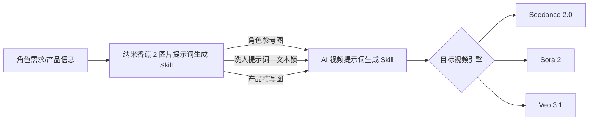

# 🎨 纳米香蕉 2 图片提示词生成 Skill

> **将角色描述、产品信息或分镜需求，精准转化为纳米香蕉 2（Imagen 3）的结构化图片提示词**

---

## 📌 这是什么？

这是一个专为 **AI 图片生成** 设计的 Agent Skill。它接收角色描述、产品信息或分镜需求，精准转化为可直接投喂 **纳米香蕉 2（Nano Banana 2 / Imagen 3）** 的结构化提示词。核心产出包括**多角度角色参考图**、**产品展示图**、**6 宫格分镜预览**和**"洗人"提示词**。

核心理念：**最大化 UGC 真实感、角色一致性和跨图连贯性**，让 AI 生成的图片看起来像真人用手机拍的。

---

## ✨ 核心能力

| 能力 | 说明 |
|------|------|
| 👤 **UGC 角色肖像** | 五步法创建虚拟演员：角色小传 → 多角度参考图 → "洗人"提示词 → 局部精修 → 姿态生成 |
| 📦 **产品展示图** | 三种模式：白底特写、UGC 场景化、POV 使用中 |
| 🎬 **6 宫格分镜** | 单图快速布局 或 多图高画质串联，角色自动一致 |
| 🔗 **视频 Skill 衔接** | 输出直接对接 AI视频提示词生成skill 的 `@图片` 参考 + 文本锁 |
| 🎯 **去 AI 化引擎** | 内置全局 UGC 原生感视觉约束，消除 AI 精致感 |

---

## 🚀 快速开始

### 使用示例

```
请帮我创建一个美区 TikTok 的虚拟演员：
- 28 岁白人女性
- 邻家感、活泼
- 日常居家穿搭
- 用于 Seedance 2.0 视频参考

请生成纳米香蕉 2 的多角度参考图提示词和洗人提示词。
```

---

## 🎯 5 段式提示词公式

每条提示词按此公式生成：

```
[主体] + [动作/姿态] + [环境/场景] + [光影/风格] + [画质/参数]
```

| 段落 | 说明 | 示例 |
|------|------|------|
| **主体** | 核心对象外观 | `28-year-old Caucasian woman with freckles, messy bun` |
| **动作/姿态** | 姿态或状态 | `holding coffee mug, leaning on counter` |
| **环境/场景** | 背景空间 | `cluttered suburban kitchen, cereal boxes visible` |
| **光影/风格** | 光线与视觉 | `warm morning window light, slight lens flare` |
| **画质/参数** | 设备与参数 | `shot on iPhone 15 Pro, 3:4 portrait, grainy` |

---

## 👤 角色肖像五步法

| 步骤 | 作用 | 产出 |
|------|------|------|
| ① 定义角色小传 | 建立角色全部视觉属性 | Character Bible（中英双语） |
| ② 多角度参考图 | 5 组不同角度的提示词 | 正面/侧面/全身/动作/情绪 |
| ③ 洗人提示词 | 消除 AI 精致感 | 中文版（Seedance）+ 英文版（Veo/Sora） |
| ④ 局部精修 | Inpainting 定向修正 | 皮肤/头发/背景/衣物细化 |
| ⑤ 姿态参考 | 按指定姿态生成 | 火柴人/参考动作驱动 |

---

## 📦 产品展示图三种模式

| 模式 | 适用场景 | 风格 |
|------|---------|------|
| **A: 白底特写** | 电商主图、视频产品锚定 | 干净、居中、细节清晰 |
| **B: UGC 场景化** | TikTok 原生感产品入场 | 生活化、凌乱、手机质感 |
| **C: 使用中** | POV 操作图、动作参考 | 第一人称、手持操作 |

---

## 🎬 6 宫格分镜图

| 方法 | 画质 | 速度 | 适用 |
|------|------|------|------|
| **单图布局** | ⭐⭐ | ⚡⚡⚡ | 快速构思、创意预审 |
| **多图串联** | ⭐⭐⭐ | ⚡ | 正式产出、用于视频提示词 |

---

## 🎨 UGC 原生感三大支柱

| 支柱 | 核心原则 | 关键提示词 |
|------|----------|-----------|
| **手机质感** | 对抗过度精致 | `shot on iPhone`, `handheld shake`, `slightly blurry` |
| **生活瑕疵** | 制造真实不完美 | `messy background`, `cluttered desk`, `bad lighting` |
| **真实皮肤** | 杜绝恐怖谷 | `freckles`, `visible pores`, `uneven skin tone` |

> *"越糙越真。提示词必须让图片像真人用手机随手拍的。"*

---

## 📂 目录结构

```
纳米香蕉2图片提示词生成skill/
├── SKILL.md                              # 🔧 核心指令文件
├── README.md                             # 📖 本文档
├── examples/                             # 📚 实战示例
│   ├── ugc-character-portrait.md         #    UGC 角色肖像全流程示例
│   ├── product-showcase.md               #    产品展示图生成示例
│   └── 6-panel-storyboard.md             #    6 宫格分镜图生成示例
├── resources/                            # 📦 资源库
│   ├── prompt-templates.md               #    使用模板 & 前置检查清单
│   ├── ugc-style-keywords.md             #    UGC 风格关键词库
│   └── prompt-formula-cheatsheet.md      #    提示词公式与参数速查
└── output/                               # 📤 生成内容输出目录
```

---

## 🔗 工作流协同

本 Skill 是完整 AI 视频制作流水线的**上游环节**：



- **下游**：生成的角色参考图和洗人提示词，直接用于 `AI视频提示词生成skill` 中的 `@图片` 标签和文本锁
- **独立使用**：也可独立用于生成角色设计、产品图、分镜预览

---

## 🛡️ 质量保障

每次输出前自动执行 **8 项质量自检**：

1. ✅ 5 段式完整性（主体+动作+环境+光影+画质）
2. ✅ UGC 风格一致性（无影棚感、含手机拍摄 UGC 关键词）
3. ✅ Prompt 长度 60-120 词
4. ✅ 皮肤真实感（含瑕疵描述、避免恐怖谷）
5. ✅ 角色跨图一致性（核心特征逐条复用）
6. ✅ 洗人提示词完整（中英双语）
7. ✅ 比例参数正确（9:16 / 3:4 / 1:1）
8. ✅ 禁用词扫描（无模糊美学词/专业摄影词/AI 机械词）

---

## 🚫 禁忌清单

| 类型 | ❌ 禁止 | ✅ 替代 |
|------|---------|---------| 
| 模糊美学 | `beautiful`, `gorgeous`, `stunning` | 具体五官和皮肤特征描述 |
| 专业摄影 | `studio lighting`, `DSLR`, `cinematic` | `phone flash`, `window light` |
| 过度完美 | `flawless skin`, `perfect hair` | `freckles`, `messy bun`, `visible pores` |
| AI 机械词 | `Elevate`, `Revolutionary` | 自然口语化描述 |
| 超长提示词 | 超 120 词的 Prompt | 精简至 60-120 词 |

---

## 💡 高级技巧

- **文字渲染**：用双引号标注文字内容，如 `a sign that says "SALE"`
- **空间逻辑**：最多 14 个物体空间关系，丰富场景细节
- **多角色**：同工作流支持 5 个角色特征稳定
- **局部重绘**：用 Inpainting 添加生活化瑕疵，提升 UGC 可信度
- **姿态参考**：上传火柴人草图驱动角色姿态
